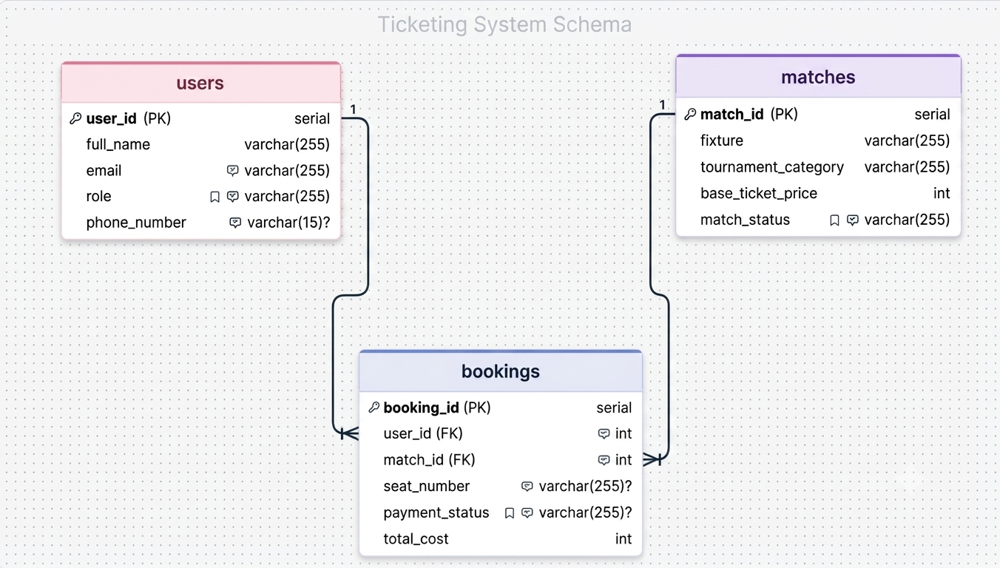

# Football Ticket Booking System — PostgreSQL

A relational database project modelling a three-table ticket booking system for football matches, implemented in PostgreSQL.

## Table of Contents

- [Project Overview](#project-overview)
- [Entity Relationship Diagram](#entity-relationship-diagram)
- [Database Schema](#database-schema)
- [Relationships](#relationships)
- [SQL Queries Reference](#sql-queries-reference)
- [Sample Query Outputs](#sample-query-outputs)
- [How to Run](#how-to-run)
- [File Structure](#file-structure)
- [Viva Recording](#viva-recording)

---

## Project Overview

This project implements a simplified football ticket booking system using a three-table PostgreSQL database. It tracks registered users (football fans and ticket managers), available match fixtures across multiple tournaments, and individual ticket booking records that link each user to their chosen match with seat and payment details.

The SQL file (`QUERIES.sql`) demonstrates a full database lifecycle: DDL table creation with typed constraints and foreign keys, DML data seeding with realistic sample records, and seven SELECT queries covering a range of intermediate SQL techniques. Built as a database design and SQL assignment submission.

---

## Entity Relationship Diagram



> Full interactive diagram: [DrawSQL — football-ticketing-db](https://drawsql.app/teams/rhmunna143/diagrams/football-ticketing-db)

---

## Database Schema

### Users Table

| Column | Type | Constraints |
|---|---|---|
| user_id | SERIAL | PRIMARY KEY |
| full_name | VARCHAR(255) | NOT NULL |
| email | VARCHAR(255) | UNIQUE, NOT NULL |
| role | VARCHAR(255) | CHECK IN ('Football Fan', 'Ticket Manager'), DEFAULT 'Football Fan', NOT NULL |
| phone_number | VARCHAR(255) | nullable |

### Matches Table

| Column | Type | Constraints |
|---|---|---|
| match_id | SERIAL | PRIMARY KEY |
| fixture | VARCHAR(255) | NOT NULL |
| tournament_category | VARCHAR(255) | NOT NULL |
| base_ticket_price | INT | NOT NULL, CHECK >= 0 |
| match_status | VARCHAR(255) | CHECK IN ('Available', 'Selling Fast', 'Sold Out', 'Postponed'), DEFAULT 'Available' |

### Bookings Table

| Column | Type | Constraints |
|---|---|---|
| booking_id | SERIAL | PRIMARY KEY |
| user_id | INT | FK → Users(user_id) |
| match_id | INT | FK → Matches(match_id) |
| seat_number | VARCHAR(255) | nullable |
| payment_status | VARCHAR(255) | CHECK IN ('Pending', 'Confirmed', 'Cancelled', 'Refunded'), nullable |
| total_cost | INT | NOT NULL, CHECK >= 0 |

---

## Relationships

- **Users → Bookings (One-to-Many):** A single user can hold multiple bookings, but each booking belongs to exactly one user. The `user_id` foreign key in Bookings enforces this link.
- **Matches → Bookings (One-to-Many):** A single match can appear in multiple bookings, but each booking references exactly one match. The `match_id` foreign key in Bookings enforces this link.

```
Users ──< Bookings >── Matches
 (1)       (many)        (1)
```

---

## SQL Queries Reference

All seven queries are in [`QUERIES.sql`](./QUERIES.sql). The table below summarises each one.

| # | Description | Tables Used | SQL Concepts |
|---|---|---|---|
| 1 | Retrieve Champions League matches with Available status | Matches | `WHERE`, `AND` |
| 2 | Search users whose name starts with 'Tanvir' or contains 'Haque' | Users | `ILIKE`, `OR` |
| 3 | Find bookings with missing payment status, label as 'Action Required' | Bookings | `IS NULL`, `COALESCE` |
| 4 | Booking details joined with user name and match fixture | Users, Bookings, Matches | `INNER JOIN`, `USING` |
| 5 | All users and their booking IDs, including users with no bookings | Users, Bookings | `LEFT JOIN`, `USING` |
| 6 | Bookings where total cost exceeds the average cost | Bookings | Scalar subquery, `AVG()` |
| 7 | Top 2 most expensive matches, skipping the single highest-priced | Matches | Subquery, `MAX()`, `LIMIT` |

---

## Sample Query Outputs

### Query 1 — Champions League Available Matches

| match_id | fixture | base_ticket_price |
|---|---|---|
| 101 | Real Madrid vs Barcelona | 150 |
| 103 | Bayern Munich vs PSG | 130 |

### Query 2 — Name Search (Tanvir / Haque)

| user_id | full_name | email |
|---|---|---|
| 1 | Tanvir Rahman | tanvir@mail.com |
| 2 | Asif Haque | asif@mail.com |

### Query 5 — All Users with Booking IDs (LEFT JOIN)

| user_id | full_name | booking_id |
|---|---|---|
| 1 | Tanvir Rahman | 501 |
| 1 | Tanvir Rahman | 502 |
| 2 | Asif Haque | 503 |
| 2 | Asif Haque | 504 |
| 3 | Sajjad Rahman | 505 |
| 4 | Jannat Ara | NULL |

### Query 6 — Above-Average Cost Bookings

Average total cost across all bookings = **138**. Bookings with `total_cost > 138`:

| booking_id | match_id | total_cost |
|---|---|---|
| 501 | 101 | 150 |
| 503 | 101 | 150 |
| 504 | 101 | 150 |

---

## How to Run

### Prerequisites

- PostgreSQL 13 or higher installed and running locally
- [Beekeeper Studio](https://www.beekeeperstudio.io/) (Community or Ultimate edition)

### Steps

1. **Clone the repository**

   ```bash
   git clone https://github.com/rhmunna143/football-ticketing-system-db.git
   ```

2. **Open Beekeeper Studio** → click **New Connection** → select **PostgreSQL**

3. **Fill in connection details**

   | Field | Value |
   |---|---|
   | Host | `localhost` |
   | Port | `5432` |
   | User | `postgres` |
   | Password | *(your local PostgreSQL password)* |
   | Database | `football_ticketing` *(create it first, or use `postgres`)* |

4. **Click Connect** — Beekeeper Studio opens the query editor

5. **Open `QUERIES.sql`** — go to **File → Open** or drag the file into the editor

6. **Run the full file** — press `Ctrl+Shift+Enter` or click the **Run All** button to create tables, seed data, and execute all 7 queries

7. **View results** in the Results panel at the bottom of the editor

---

## Viva Recording

Theory questions answered on camera (Questions 1, 3 & 4) — Foreign Keys, Primary Keys & NULL, and LEFT JOIN behaviour.

[](https://youtu.be/LYA_vrx7AdI)

> [Watch on YouTube →](https://youtu.be/LYA_vrx7AdI)

---

## File Structure

```
football-ticketing-system-db/
├── QUERIES.sql                    # DDL, DML, and all 7 SELECT queries
├── pseudo-ddl-QUERY-template.sql  # Blank schema template for reference
├── ERD-img.png                    # Entity Relationship Diagram (exported image)
└── README.md                      # Project documentation
```
